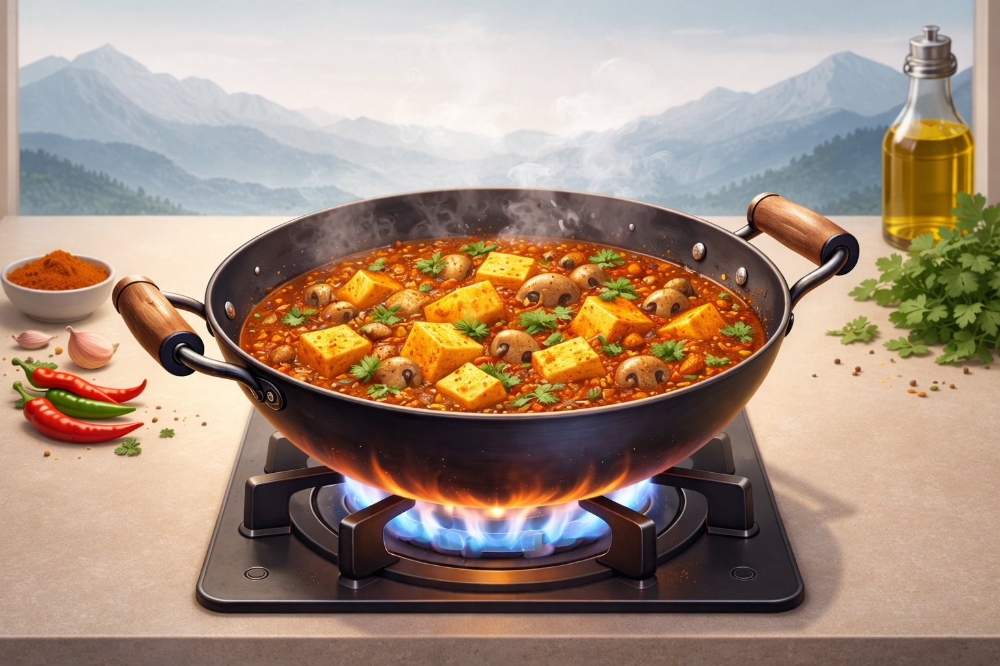
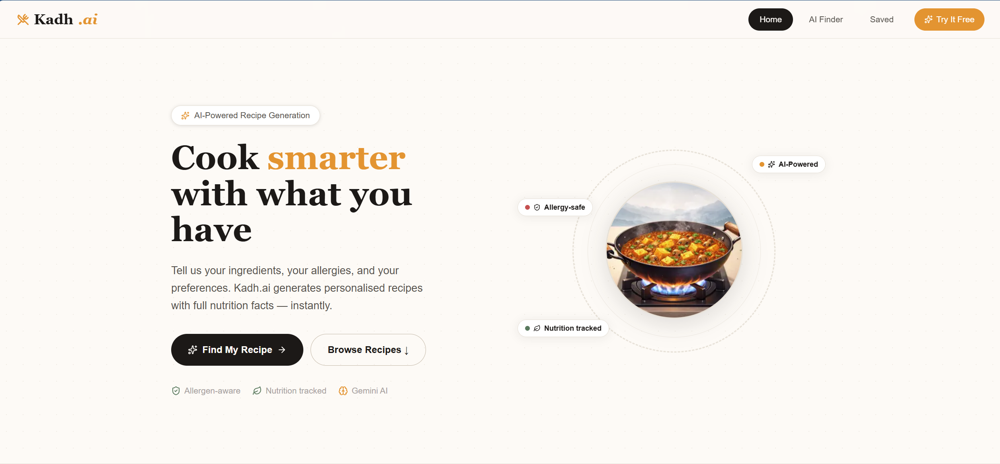
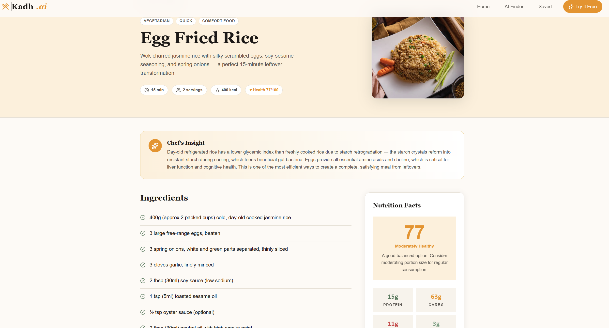
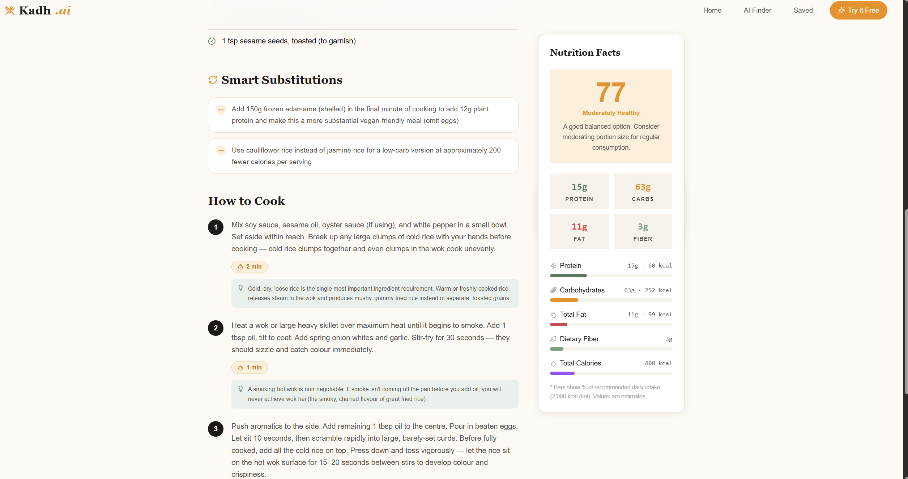
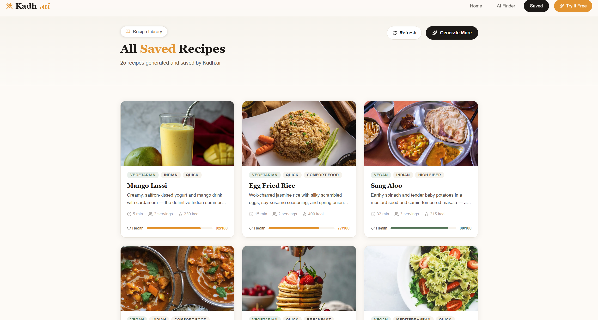

# 🍳 Kadh.ai

**An AI-powered culinary assistant that transforms your available ingredients into structured, macro-balanced recipes.**

---

## 🚀 Live Demo

https://kadh-ai.vercel.app/

---

## ❓ Why Kadh.ai?

Everyday cooking decisions are surprisingly complex:
- Limited ingredients at home  
- Dietary restrictions or allergies  
- Confusion about what’s healthy or balanced  

Most tools either provide static recipes or ignore real-world constraints.

Kadh.ai solves this by transforming **user constraints into intelligent outputs** — generating recipes that are not just creative, but also nutritionally structured and context-aware.

Instead of asking:
> “What recipe should I follow?”

Kadh.ai answers:
> “What is the best possible meal I can make right now?”

This project is designed as a step toward building a truly intelligent, decision-driven cooking assistant.

## 📸 Demo Preview

### 🔹 Recipe Generation Flow


### 🔹 Example Output

**Input:**

```
onion, tomato, paneer
```

**Output:**

* Paneer Masala
* Calories: ~420 kcal
* Protein: 22g
* Carbs: 18g
* Fat: 28g
* Fiber: 5g
* Health Score: 8.2 / 10



## 📸 Screenshots






---

## 🧠 Overview

Kadh.ai solves the everyday **“what’s for dinner?”** problem using AI.

By inputting available pantry ingredients, dietary restrictions, and allergies, the app generates **realistic, structured, and nutritionally balanced recipes** using Google Gemini.

---

## ✨ Key Features

### 🥘 Pantry-to-Plate Generation

Generate complete recipes instantly from available ingredients.

### 🚫 Strict Dietary Guardrails

Ensures allergies and restrictions are strictly enforced during generation.

### 📊 Nutritional Intelligence

* Calories
* Macronutrients (Protein, Carbs, Fat, Fiber)
* Serving size estimation

### 🧠 Health Score (Transparent Logic)

Each recipe is assigned a **Health Score (0–10)** based on:

* Protein density (higher = better)
* Calorie balance per serving
* Fiber content
* Fat proportion

> This score helps users quickly evaluate nutritional quality.

---

### 🖼️ Dynamic Media Integration

* Fetches relevant food images using Unsplash API
* Improves visual experience automatically

### 💾 Persistent Recipe Library

* Save recipes to Supabase database
* Browse previously generated recipes

### 🎨 Modern UI/UX

* Built with Tailwind CSS
* Interactive recipe cards
* Smooth loading states

---

## 🏗️ System Architecture

Kadh.ai follows a **secure client-server architecture**:

* **Client (Next.js):** Handles UI and user input

* **API Layer (/api/generate):**

  * Prompt engineering
  * Gemini API interaction
  * Nutrition structuring

* **Parallel Processing:**

  * Fetch recipe image (Unsplash)
  * Store data (Supabase)

* **Response Hydration:**

  * Fully structured recipe returned to UI

---

## 🧰 Tech Stack

* **Frontend:** Next.js (React), TypeScript, Tailwind CSS
* **Backend:** Next.js API Routes (Serverless)
* **Database:** Supabase (PostgreSQL)
* **AI Provider:** Google Gemini 1.5 Flash
* **Media:** Unsplash API
## 🧩 Key Engineering Decisions

- **Serverless API Layer (Next.js API Routes)**  
  Chose server-side API routes to securely handle Gemini API calls and protect sensitive keys from client exposure.

- **Parallel Processing for Performance**  
  Designed the system to fetch AI-generated recipes, images (Unsplash), and database writes simultaneously, reducing total response latency.

- **Structured Prompt Engineering**  
  Crafted prompts to enforce strict dietary constraints, structured outputs, and nutritional consistency rather than relying on free-form generation.

- **Supabase for Scalable Persistence**  
  Used Supabase (PostgreSQL) to enable serverless, scalable storage of generated recipes with minimal backend overhead.

- **Component-Based UI Architecture**  
  Built reusable React components (RecipeCard, NutritionPanel, etc.) to maintain clean separation of concerns and scalability.

- **Stateless System Design (Intentional Trade-off)**  
  Kept the system stateless to ensure simplicity, fast response times, and reliability, while leaving room for future personalization features.
---

## 📂 Project Structure

```
Kadh.ai/
├── public/
│   └── kadh-hero.png             # Static assets and images
├── src/
│   ├── app/                      # Next.js App Router (Pages & API)
│   │   ├── api/                  # Serverless API Endpoints
│   │   │   ├── generate/
│   │   │   │   └── route.ts      # Gemini AI integration & Unsplash logic
│   │   │   ├── photo/
│   │   │   │   └── route.ts      # Legacy client-side Unsplash fetching
│   │   │   └── seed/
│   │   │       └── route.ts      # Supabase database seeding script
│   │   ├── find/
│   │   │   └── page.tsx          # Core recipe generation UI & forms
│   │   ├── recipe/
│   │   │   └── [id]/
│   │   │       └── page.tsx      # Dynamic individual recipe detail view
│   │   ├── saved/
│   │   │   └── page.tsx          # User's saved community recipes library
│   │   ├── globals.css           # Tailwind CSS configuration & global styles
│   │   ├── layout.tsx            # Root application layout shell
│   │   ├── not-found.tsx         # Custom 404 error page
│   │   └── page.tsx              # Application landing/home page
│   ├── components/               # Reusable React UI Components
│   │   ├── AllergySelector.tsx   # Dietary preference toggles
│   │   ├── IngredientInput.tsx   # Dynamic input for pantry items
│   │   ├── Navbar.tsx            # Global navigation header
│   │   ├── NutritionPanel.tsx    # Macros and health score visualizer
│   │   └── RecipeCard.tsx        # Reusable recipe preview card
│   └── lib/                      # Shared Utilities & Configs
│       └── supabase.ts           # Supabase client and DB helper functions
├── .env.local                    # Secret environment variables (ignored in Git)
├── next.config.mjs               # Next.js framework configuration
├── package.json                  # NPM dependencies and project scripts
├── tailwind.config.ts            # Tailwind design system configuration
└── README.md                     # Project documentation
```

---

## ⚙️ Local Setup

```bash
git clone https://github.com/Anshu-raj-co/Kadh.ai.git
cd Kadh.ai
npm install
```

### Add Environment Variables

```
GEMINI_API_KEY=your_key
UNSPLASH_ACCESS_KEY=your_key
NEXT_PUBLIC_SUPABASE_URL=your_url
NEXT_PUBLIC_SUPABASE_ANON_KEY=your_key
SUPABASE_SERVICE_ROLE_KEY=your_key
```

```bash
npm run dev
```

---

## ⚠️ Limitations

- AI-generated recipes may vary in consistency due to the probabilistic nature of LLMs  
- Nutritional values are estimated and not clinically accurate  
- No user-level personalization or memory in the current version  
- Performance depends on external API response times (Gemini, Unsplash, Supabase)  
## 🗺️ Future Roadmap

* [ ] User authentication (Supabase Auth)
* [ ] Grocery list generator
* [ ] AI-based ingredient substitution
* [ ] Personalized recommendations

---

## 👨‍💻 Author

**Anshu Raj**

* GitHub: https://github.com/Anshu-raj-co
* LinkedIn: https://www.linkedin.com/in/anshu-raj-373349287/

---

## ⭐ Final Note

Kadh.ai is designed not just as a recipe generator, but as a **foundation for an intelligent cooking assistant**, combining AI, nutrition, and real-world usability.
